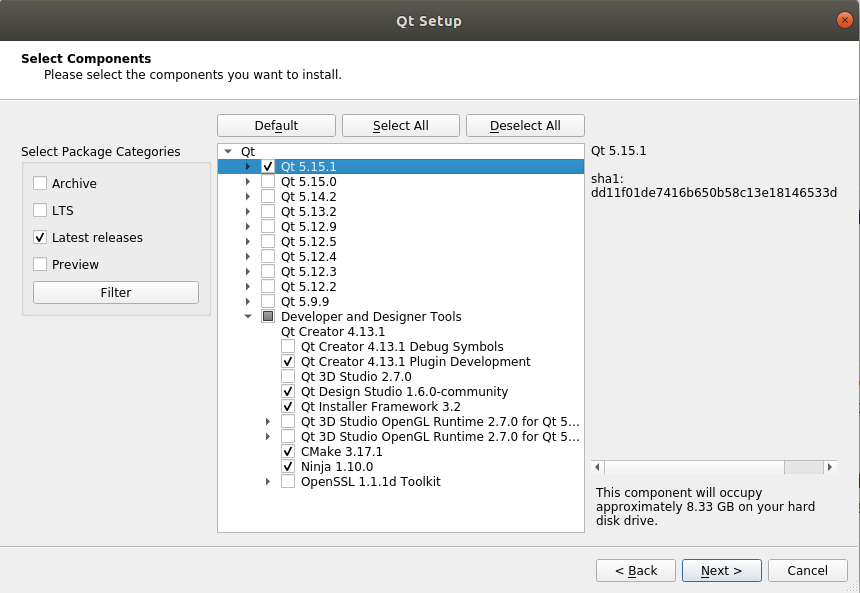

###[download qt unified installer](https://www.qt.io/download-qt-installer)  
  
###[uninstall qt on ubuntu](https://stackoverflow.com/questions/39625379/how-to-uninstall-qt5)
###[qt tutorial](https://www.youtube.com/results?search_query=qt+tutorial)
###[Qt Project](http://www.qt-project.org)
###[Digia Site](http://qt.digia.com)
###[Qt Youtube Channel](https://www.youtube.com/channel/UCsyT1C1M-QoHQREjsixgayQ)  
- [Introduction to Qt - Qt Creator IDE Overview and Examples](https://www.youtube.com/watch?v=R6zWLfHIYJw&ab_channel=Qt)

